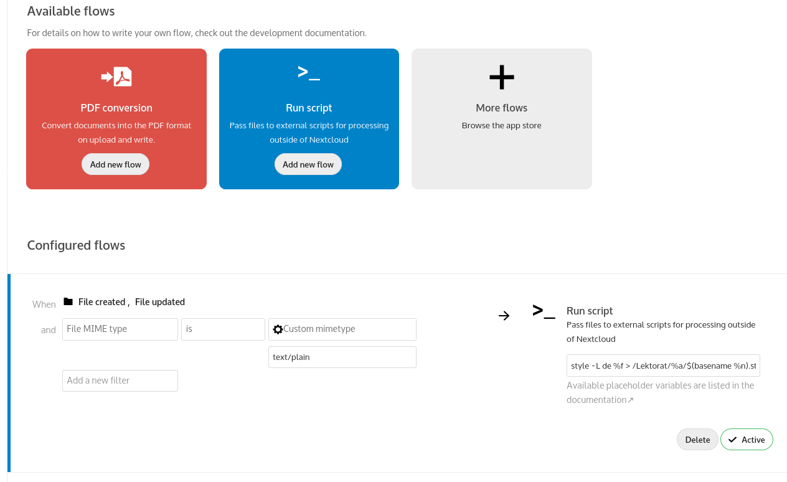

# Nextcloud Workflow Script app

This app enables Nextcloud to pass on files to external scripts when they were created or changed. By utilizing the workflow engine it allows Nextcloud administrators to define rules upon which matching files are enqueued to be run against a specified script. Eventually, the command is executed in a background job. 

Learn more about workflows on https://nextcloud.com/workflow



## Placeholders

After enabling this app, rules can be defined in the admin settings, "External scripts" section.

When defining the script, you can specify one of the following placeholders that will be replaced with the appropriate value:

| Placeholder | Description | example value
--- | --- | ---
%e | the event type | *\OCP\Files::postCreate*, *\OCP\Files::postWrite* or *\OCP\Files::postRename*
%i | file id | *142430*
%a | actor's user id | *bob*
%o | owner's user id | *alice*
%n | nextcloud-relative path | *alice/files/Pictures/Wonderland/20180717_192103.jpg*
%f | locally available file | */tmp/oc_tmp_m6E6OO-.jpg*
%x | old nextcloud-relative file path (only on *rename* and *copy*) | *alice/files/Workbench/20180717_192103.jpg*

When no placeholder was specified, then the exact command as given is being executed.

### Hints

Events for files and folders are triggered by file system operations. An operation like
\OCP\Files::postCopy is read, create and write a file. 

| Action | Events |
| --- | --- |
| Copy file | \OCP\Files::postCopy<br />\OCP\Files::postCreate<br />\OCP\Files::postWrite
| Create file | \OCP\Files::postTouch<br />\OCP\Files::postCreate<br /> \OCP\Files::postWrite
| Delete file | \OCP\Files::postDelete
| Move file | \OCP\Files::postRename
| Rename file | \OCP\Files::postRename
| Update file | \OCP\Files::postWrite

### Example

All plain text files should be passed to a tool that collects statistics of the writing style of a document and writes them back to a specified mount on the host, in a subfolder that matches the actor's ID, and filename consisting of the basename plus ".style" appended:

  

```
style -L de %f > /Lektorat/%a/$(basename %n).style
```

And after the cron job was run, you'll find the results on the expected place: 

```
$ cat /Lektorat/bob/Sanin\ -\ Artsybashev.txt.style
readability grades:
        Kincaid: 10.2
        ARI: 10.4
        Coleman-Liau: 10.6
        Flesch Index: 55.7/100
        Fog Index: 12.5
        Lix: 39.0 = school year 6
        SMOG-Grading: 6.4
sentence info:
        684404 characters
        143798 words, average length 4.76 characters = 1.56 syllables
        7606 sentences, average length 18.9 words
        47% (3591) short sentences (at most 14 words)
        18% (1390) long sentences (at least 29 words)
        1 paragraphs, average length 7606.0 sentences
        4% (378) questions
        24% (1849) passive sentences
        longest sent 164 wds at sent 339; shortest sent 1 wds at sent 4
word usage:
        verb types:
        to be (2154) auxiliary (1581) 
        types as % of total:
        conjunctions 7% (10560) pronouns 9% (12733) prepositions 8% (10894)
        nominalizations 1% (1638)
sentence beginnings:
        pronoun (1209) interrogative pronoun (306) article (795)
        subordinating conjunction (275) conjunction (701) preposition (529)

```
## Limitations

This app does not work with either encryption method.
